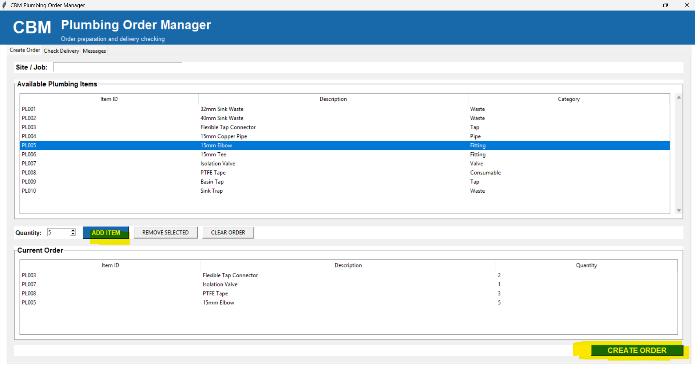
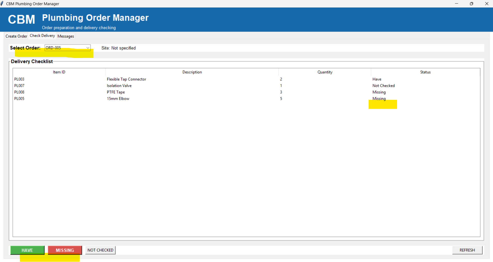
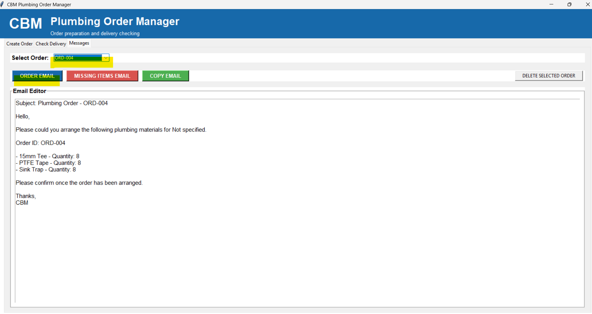

# Plumbing Order Management App

A simple Python desktop application developed to help organise plumbing
material orders and delivery checks for a refurbishment company.

## Features

- Create plumbing material orders
- Add items and quantities
- Generate unique order IDs
- Check delivered and missing items
- Generate order emails
- Generate missing-item emails
- Save orders locally using JSON

## Screenshots

### Create Order

### Check Delivery

### Messages

## Technologies

- Python
- Tkinter
- JSON
- PyInstaller

## Download

Windows users can download the `.exe` version and run the application
without installing Python.
